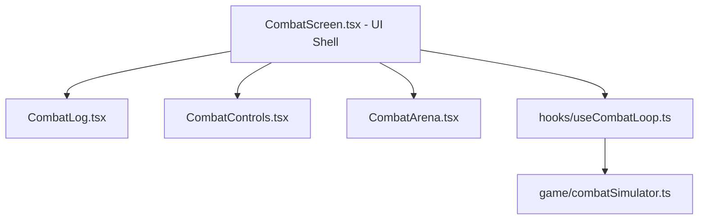

# ACTIVE CODE ARCHITECTURE AUDIT

This report provides a comprehensive review of the active Vaelmour_Game codebase prior to the architectural refactor. It highlights structural issues, performance bottlenecks, state-management risks, and proposes a prioritized roadmap to transition into a modular and reliable system.

---

## 1. Combat Architecture

### Current Findings & Overloading
The file [CombatScreen.tsx](file:///c:/Users/h1sok/OneDrive/Робочий стіл/Vaelmour/Vaelmour_Game/src/features/combat/CombatScreen.tsx) is a **monolithic container (1,420+ lines)** that violates the Single Responsibility Principle (SRP). It is currently managing:
- **State Machine & Flow:** Tracking hunt states (`idle`, `searching`, `fighting`, `victory`, `defeat`), spawning mechanics, and zone transitions.
- **Combat Simulation Loop:** Asynchronous timeout recursions (`scheduleHeroAttack`, `scheduleEnemyAttack`), ticking logic for statuses (bleed, stagger, timers), and basic attack triggers.
- **Victory & Rewards Distribution:** Calculating XP, scaling gold, rolling loot tables, rolling equipment affixes, leveling up checks, and mutating the global `hero` state.
- **Game/Gameplay Logic:** Executing combat mechanics formulas directly within UI-centric event handlers.
- **Localization/Translation Regex:** Heavy Regex matching directly in the render/log workflow to translate English logs to Ukrainian on the fly.
- **Direct SVG Render & Asset Management:** Embedding large inline SVG graphics (`EnemyVectorSVG`) and managing asset configurations.

### useEffect, Timer, and Interval Risks
1. **Asynchronous State Drifts:**
   The combat simulation uses `setTimeout` recursion to schedule ticks. Inside these timeouts, handlers rely on `latestHero.current` (via refs). However, React state transitions are asynchronous. If a user clicks a skill button (e.g., `handleUseSkill`), it modifies `hero` state synchronously relative to the UI, but the ref might not have been fully flushed, causing race conditions and state desynchronization.
2. **Double Execution in StrictMode:**
   In development environments under React 18 `StrictMode`, effects run twice. While the cleanup functions clear the scheduled timeouts (`clearTimeout(heroTimeoutId)`), the setup reschedules them. Any unmanaged side-effects or misaligned refs can cause double-attacks or orphan timers.
3. **Timer Clashing:**
   Both `searchTimeoutRef` and `victoryTimeoutRef` are cleared on location change, but there are multiple paths where timers could leak if UI screens shift rapidly.

### Proposed Target Split (P0)
To decouple the UI from game loops, we propose separating the file into the following components:

- `src/features/combat/hooks/useCombatLoop.ts`: Custom hook to manage the core combat state machine, inputs, and timer triggers.
- `src/features/combat/components/CombatArena.tsx`: Pure presentational display of the hero and enemy sprites, health bars, and damage flashes.
- `src/features/combat/components/CombatControls.tsx`: Presentational view for the action buttons, active skill panels, and cooldown bars.
- `src/features/combat/components/CombatLog.tsx`: View list handling formatted entry rendering and regex translation logic.

---

## 2. Derived Stats Architecture

### Current Findings & Recalculation Overhead
The [calculateDerivedStats](file:///c:/Users/h1sok/OneDrive/Робочий стіл/Vaelmour/Vaelmour_Game/src/game/formulas/stats.ts#L47) function calculates `maxHp`, `attackPower`, `critChance`, `dodgeChance`, `accuracy`, and `healthRegen` by iterating over all 10 equipment slots, resolving item files statically, checking durability factors, and processing dynamic affixes.

**Call Site Risks:**
- **Render-Phase Recalculation:** Called directly in the body of `AppShell.tsx`, `CharacterScreen.tsx`, and `CombatScreen.tsx` during renders.
- **Multiple Runs per Tick:** During combat, any tick recalculates stats over and over, compounding performance costs.

### Proposed Solution (P0)
Introduce a cached stat mechanism where stats are recalculated **only on changes to equipment or base stats (strength, agility, vitality, level)**.
- Introduce `hero.effectiveStats` directly in the database/state model, or maintain a cached derived object via a selector.
- Transition `calculateDerivedStats` into a memoized selector, running ONLY when:
  `[hero.stats, hero.equipment, hero.equipmentDurability, hero.equippedGeneratedItems]` change.

---

## 3. Hero State Update Flow

### Current Mutation Risks
Currently, `hero` is updated via `onHeroChange` passed down from the root `AppShell.tsx`.
- During combat victory:
  `rewardedHero` is constructed manually by overriding nested structures (`hero.inventory`, `hero.xp`, `hero.level`).
- **Durability Decay:**
  Equipment durability decays during combat ticks, calling `applyWeaponDurabilityLoss` and `applyArmorDurabilityLoss` which trigger structural copies of the hero object.
- **Overwrites:**
  If a player triggers a skill while durability decays or regeneration tick fires, multiple React state setters compete to modify the same parent `hero` state.

---

## 4. Save and Persistence

### Local vs. Cloud Save Interactions
The client relies on debounced localStorage saves (`scheduleSaveGame` with `800ms` debounce) and debounced cloud saves (`scheduleCloudPlayerSave` with `5000ms` debounce) pushed to a Netlify function.

```
[State Update] ──> scheduleSaveGame (800ms) ──> LocalStorage
               ──> scheduleCloudPlayerSave (5000ms) ──> Netlify / Supabase
```

### Race Conditions & Overwrite Risks
1. **Unchecked Startup Load:**
   If a user launches the game, a delay in loading the cloud save might let the user interact with the game using the local save. Once the cloud save finally loads, it will overwrite the active progress.
2. **Debounce Overlap:**
   If the player closes the WebApp while a save is debouncing, `flushCloudPlayerSave` triggers `keepalive` fetch calls. If the network drops or requests arrive out of order, older data could overwrite newer database rows in Supabase.

---

## 5. Equipment / Item Model Inconsistencies

We found discrepancies in naming conventions across static configurations and generated items:
- **Health:** `maxHealth` vs. `maxHp` vs. `hpBonus`
- **Defense:** `defense` vs. `armor` vs. `armorStats`
- **Dodge:** `dodgeBonus` vs. `dodgeChance`

**Proposed Action (P1):**
Normalize all data configurations (`armors.ts`, `weapons.ts`, `shields.ts`, `items.ts`) to use a strict, single structural type interface.

---

## 6. UI Performance & Telegram WebApp Optimization

### Mobile WebView Bottlenecks
- **Large Combat Logs:**
  As combat progresses, the log length is capped, but rendering translations and evaluating style objects inline for list elements creates rendering lag on budget mobile devices.
- **Unmemoized Sub-Components:**
  Changes in active combat states (health, rage, cooldowns) trigger full-screen rerenders of `CombatScreen`. Presentational panels like the location select should be fully memoized.

---

## 7. Refactor Roadmap

| Priority | Task Description | Target Files |
| :--- | :--- | :--- |
| **P0** | Extract core simulation loop from `CombatScreen.tsx` into a stateful hook/helper. | `CombatScreen.tsx` |
| **P0** | Memoize `calculateDerivedStats` and prevent render-phase recalculation loops. | `stats.ts`, `AppShell.tsx` |
| **P1** | Normalize item model property names (`maxHealth`/`maxHp`, `dodgeBonus`/`dodgeChance`). | `types.ts`, `stats.ts`, items/ |
| **P1** | Add locking locks/guards on startup to block player inputs until Cloud Save has loaded. | `AppShell.tsx`, `playerCloudSave.ts` |
| **P2** | Extract localized text translation from rendering routines into static translation dictionaries. | `CombatScreen.tsx`, `displayHelpers.ts` |

---

## What Should NOT Be Touched Yet
- **`src/game/formulas/combat.ts`:** Leave core damage calculators alone until the component shell split is stable.
- **Quest Objectives Registry:** Do not modify quest schema or objectives logic to avoid breaking active save states.
- **Telegram WebApp Initialization:** Do not change standard `initData` retrieval protocols.
